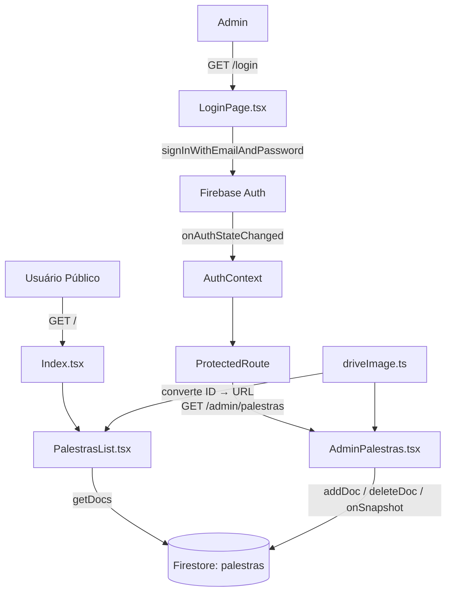
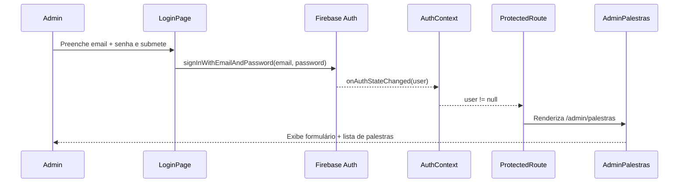
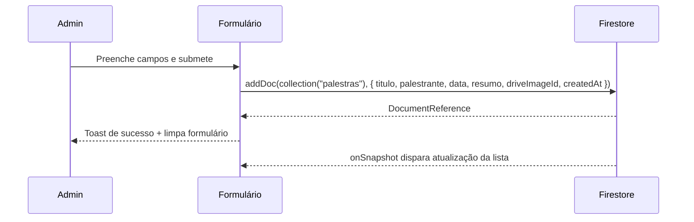
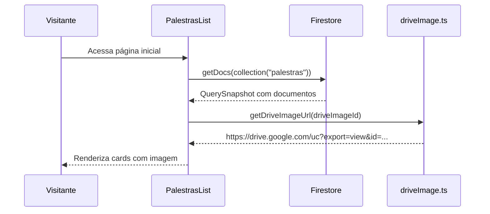

# Design Document: CMS Palestras Semanais

## Overview

PoC de área administrativa (CMS) para gerenciar "Palestras Semanais" no projeto pet-finder-pro. A feature adiciona autenticação via Firebase Auth (Email/Password), um painel admin protegido com CRUD de palestras no Firestore, e uma área pública que exibe os cards das palestras com imagens via Google Drive (Claim Check pattern).

O projeto já possui React 18, TypeScript, Vite, Tailwind CSS, shadcn/ui e react-router-dom. Firebase SDK será adicionado como nova dependência.

## Architecture



## Sequence Diagrams

### Fluxo de Login e Acesso ao CMS



### Fluxo de Adição de Palestra



### Fluxo Público de Exibição



## Components and Interfaces

### AuthContext

**Purpose**: Gerencia o estado global de autenticação via `onAuthStateChanged`.

**Interface**:
```typescript
interface AuthContextValue {
  user: User | null
  loading: boolean
  signOut: () => Promise<void>
}
```

**Responsabilidades**:
- Inicializa listener `onAuthStateChanged` no mount
- Expõe `user`, `loading` e `signOut` para toda a árvore
- Mantém `loading: true` até a primeira resposta do Firebase

### ProtectedRoute

**Purpose**: HOC de rota que redireciona para `/login` se não autenticado.

**Interface**:
```typescript
interface ProtectedRouteProps {
  children: React.ReactNode
}
```

**Responsabilidades**:
- Lê `user` e `loading` do `AuthContext`
- Exibe spinner enquanto `loading === true`
- Redireciona para `/login` se `user === null`
- Renderiza `children` se autenticado

### LoginPage (`/login`)

**Purpose**: Formulário de autenticação com Email/Password.

**Responsabilidades**:
- Formulário com campos `email` e `password`
- Chama `signInWithEmailAndPassword` do Firebase Auth
- Exibe mensagem de erro em caso de falha (credenciais inválidas, etc.)
- Redireciona para `/admin/palestras` após login bem-sucedido
- Redireciona para `/admin/palestras` se já autenticado

### AdminPalestras (`/admin/palestras`)

**Purpose**: Painel CMS com formulário de criação e lista com exclusão.

**Responsabilidades**:
- Formulário controlado com validação básica (campos obrigatórios)
- `addDoc` ao Firestore na submissão
- `onSnapshot` para lista em tempo real
- `deleteDoc` por ID ao clicar em deletar
- Estados de loading/error/success com feedback visual (toast)
- Botão de logout

### PalestrasList

**Purpose**: Componente público que exibe os cards das palestras.

**Responsabilidades**:
- `getDocs` da coleção `palestras` no mount
- Renderiza `PalestraCard` para cada documento
- Usa `getDriveImageUrl` para montar a URL da imagem
- Trata estado de loading e lista vazia

### driveImage.ts (utilitário puro)

**Purpose**: Converte ID ou link do Google Drive em URL de visualização direta.

**Interface**:
```typescript
function getDriveImageUrl(idOrLink: string): string
function extractDriveId(link: string): string
```

**Responsabilidades**:
- Se receber um link completo do Drive, extrai o ID via regex
- Retorna `https://drive.google.com/uc?export=view&id={id}`
- Função pura, sem efeitos colaterais

## Data Models

### Palestra

```typescript
interface Palestra {
  id: string                    // ID do documento Firestore (gerado automaticamente)
  titulo: string                // Título da palestra
  palestrante: string           // Nome do palestrante
  data: string                  // Data no formato YYYY-MM-DD
  resumo: string                // Resumo/descrição da palestra
  driveImageId: string          // ID ou link da imagem no Google Drive
  createdAt: Timestamp          // Timestamp de criação (Firestore)
}

type PalestraFormData = Omit<Palestra, 'id' | 'createdAt'>
```

**Regras de Validação**:
- `titulo`: obrigatório, não vazio
- `palestrante`: obrigatório, não vazio
- `data`: obrigatório, formato de data válido
- `resumo`: obrigatório, não vazio
- `driveImageId`: obrigatório, não vazio (ID ou URL do Drive)

### Firestore Security Rules

```
rules_version = '2';
service cloud.firestore {
  match /databases/{database}/documents {
    match /palestras/{docId} {
      allow read: if true;
      allow write: if request.auth != null;
    }
  }
}
```

## Key Functions with Formal Specifications

### getDriveImageUrl(idOrLink)

```typescript
function getDriveImageUrl(idOrLink: string): string
```

**Preconditions**:
- `idOrLink` é uma string não vazia
- Pode ser um ID puro (ex: `1BxiMVs0XRA5nFMdKvBdBZjgmUUqptlbs`) ou um link completo do Drive

**Postconditions**:
- Retorna sempre uma string no formato `https://drive.google.com/uc?export=view&id={id}`
- Se `idOrLink` contém `drive.google.com`, extrai o ID via regex antes de montar a URL
- Função pura: sem mutações, sem efeitos colaterais

### useAuth (hook)

```typescript
function useAuth(): AuthContextValue
```

**Preconditions**:
- Deve ser chamado dentro de um componente filho de `AuthProvider`

**Postconditions**:
- Retorna `{ user, loading, signOut }` do contexto
- Lança erro se chamado fora do `AuthProvider`

## Algorithmic Pseudocode

### Algoritmo: ProtectedRoute

```pascal
PROCEDURE ProtectedRoute(children)
  INPUT: children (React.ReactNode)
  OUTPUT: JSX Element

  SEQUENCE
    { user, loading } ← useAuth()

    IF loading = true THEN
      RETURN <Spinner />
    END IF

    IF user = null THEN
      RETURN <Navigate to="/login" replace />
    END IF

    RETURN children
  END SEQUENCE
END PROCEDURE
```

### Algoritmo: Login

```pascal
PROCEDURE handleLogin(email, password)
  INPUT: email (string), password (string)
  OUTPUT: void (side effect: navegação ou erro)

  SEQUENCE
    SET loading ← true
    SET error ← null

    TRY
      AWAIT signInWithEmailAndPassword(auth, email, password)
      NAVIGATE to "/admin/palestras"
    CATCH firebaseError
      SET error ← mapFirebaseError(firebaseError.code)
    FINALLY
      SET loading ← false
    END TRY
  END SEQUENCE
END PROCEDURE
```

### Algoritmo: Adicionar Palestra

```pascal
PROCEDURE handleAddPalestra(formData)
  INPUT: formData (PalestraFormData)
  OUTPUT: void (side effect: Firestore write + toast)

  SEQUENCE
    SET submitting ← true

    TRY
      AWAIT addDoc(collection(db, "palestras"), {
        ...formData,
        createdAt: serverTimestamp()
      })
      SHOW toast("Palestra adicionada com sucesso")
      RESET form
    CATCH error
      SHOW toast("Erro ao adicionar palestra", { variant: "destructive" })
    FINALLY
      SET submitting ← false
    END TRY
  END SEQUENCE
END PROCEDURE
```

### Algoritmo: Listener em Tempo Real

```pascal
PROCEDURE setupPalestrasListener()
  OUTPUT: unsubscribe function

  SEQUENCE
    SET loading ← true

    unsubscribe ← onSnapshot(
      query(collection(db, "palestras"), orderBy("createdAt", "desc")),
      PROCEDURE(snapshot)
        palestras ← snapshot.docs.map(doc → { id: doc.id, ...doc.data() })
        SET palestras ← palestras
        SET loading ← false
      END PROCEDURE,
      PROCEDURE(error)
        SET error ← error.message
        SET loading ← false
      END PROCEDURE
    )

    RETURN unsubscribe  // chamado no cleanup do useEffect
  END SEQUENCE
END PROCEDURE
```

## Example Usage

```typescript
// driveImage.ts
getDriveImageUrl("1BxiMVs0XRA5nFMdKvBdBZjgmUUqptlbs")
// → "https://drive.google.com/uc?export=view&id=1BxiMVs0XRA5nFMdKvBdBZjgmUUqptlbs"

getDriveImageUrl("https://drive.google.com/file/d/1BxiMVs0XRA5nFMdKvBdBZjgmUUqptlbs/view")
// → "https://drive.google.com/uc?export=view&id=1BxiMVs0XRA5nFMdKvBdBZjgmUUqptlbs"

// PalestraCard


// ProtectedRoute em App.tsx
<Route
  path="/admin/palestras"
  element={
    <ProtectedRoute>
      <AdminPalestras />
    </ProtectedRoute>
  }
/>
```

## Correctness Properties

*Uma propriedade é uma característica ou comportamento que deve ser verdadeiro em todas as execuções válidas do sistema — essencialmente, uma declaração formal sobre o que o sistema deve fazer. Propriedades servem como ponte entre especificações legíveis por humanos e garantias de correção verificáveis por máquina.*

### Property 1: getDriveImageUrl sempre retorna URL base correta

*Para qualquer* string não vazia passada a `getDriveImageUrl` (seja ID puro ou link do Drive), o resultado sempre começa com `https://drive.google.com/uc?export=view&id=`

**Validates: Requirements 2.2, 2.3**

### Property 2: getDriveImageUrl é idempotente (função pura)

*Para qualquer* string de entrada, chamar `getDriveImageUrl` duas vezes com o mesmo input deve retornar exatamente o mesmo output

**Validates: Requirements 2.5**

### Property 3: Round-trip de extração de ID do Drive

*Para qualquer* ID de Drive válido, construir um link no formato `/file/d/{id}/view` e então chamar `getDriveImageUrl(link)` deve produzir o mesmo resultado que `getDriveImageUrl(id)`

**Validates: Requirements 2.3, 2.4**

### Property 4: ProtectedRoute nunca expõe children sem autenticação

*Para qualquer* estado onde `user === null` e `loading === false`, o `ProtectedRoute` nunca deve renderizar os `children` — o output deve ser sempre um redirecionamento para `/login`

**Validates: Requirements 4.2, 4.4**

### Property 5: Formulário rejeita qualquer combinação com campo obrigatório vazio

*Para qualquer* submissão do formulário de AdminPalestras onde pelo menos um campo obrigatório (`titulo`, `palestrante`, `data`, `resumo`, `driveImageId`) está vazio ou composto apenas de espaços em branco, a submissão deve ser bloqueada e nenhum `addDoc` deve ser chamado

**Validates: Requirements 6.10**

### Property 6: PalestrasList renderiza exatamente N cards para N palestras

*Para qualquer* lista de N palestras retornadas pelo Firestore, o `PalestrasList` deve renderizar exatamente N componentes `PalestraCard`

**Validates: Requirements 7.2**

## Error Handling

### Erro de Login: Credenciais Inválidas

**Condição**: `signInWithEmailAndPassword` lança `auth/wrong-password` ou `auth/user-not-found`
**Resposta**: Exibe mensagem "E-mail ou senha inválidos." abaixo do formulário
**Recuperação**: Usuário corrige os dados e tenta novamente

### Erro de Login: Muitas Tentativas

**Condição**: Firebase lança `auth/too-many-requests`
**Resposta**: Exibe mensagem "Muitas tentativas. Tente novamente mais tarde."
**Recuperação**: Aguardar cooldown do Firebase

### Erro de Escrita no Firestore

**Condição**: `addDoc` ou `deleteDoc` falha (ex: sem conexão, regra de segurança)
**Resposta**: Toast com variante `destructive` e mensagem descritiva
**Recuperação**: Usuário pode tentar novamente; dados do formulário são preservados

### Erro de Leitura Pública

**Condição**: `getDocs` falha na área pública
**Resposta**: Exibe mensagem "Não foi possível carregar as palestras." no lugar da lista
**Recuperação**: Recarregar a página

## Testing Strategy

### Unit Testing

- `getDriveImageUrl`: testar com ID puro, link completo `/file/d/`, link de compartilhamento `/open?id=`, string vazia
- `extractDriveId`: testar todos os formatos de URL do Google Drive
- `mapFirebaseError`: testar mapeamento de códigos de erro para mensagens em português

### Property-Based Testing

**Property Test Library**: fast-check

- Para qualquer string não vazia passada a `getDriveImageUrl`, o resultado sempre começa com a URL base do Drive
- Para qualquer ID extraído de um link, `getDriveImageUrl(link) === getDriveImageUrl(extractedId)`

### Integration Testing

- Login com credenciais válidas → redireciona para `/admin/palestras`
- Login com credenciais inválidas → exibe mensagem de erro, não navega
- Acesso direto a `/admin/palestras` sem autenticação → redireciona para `/login`
- Adicionar palestra → aparece na lista em tempo real
- Deletar palestra → some da lista em tempo real

## Performance Considerations

- `onSnapshot` é usado apenas na rota `/admin/palestras` (autenticada), não na área pública — a área pública usa `getDocs` para evitar listeners desnecessários
- O listener do `onSnapshot` é cancelado no cleanup do `useEffect` para evitar memory leaks
- Imagens do Google Drive são carregadas sob demanda pelo browser; não há pré-carregamento

## Security Considerations

- Regras do Firestore: leitura pública, escrita apenas para `request.auth != null`
- Credenciais do Firebase (apiKey, etc.) são públicas por design — a segurança real está nas Security Rules
- Variáveis de ambiente via `VITE_FIREBASE_*` no `.env` (não commitado) para evitar hardcode no código
- `signOut` disponível no painel admin para encerrar a sessão explicitamente

## Dependencies

**A adicionar**:
- `firebase` (^10.x) — Firebase SDK (Auth + Firestore)

**Já presentes no projeto**:
- `react-router-dom` ^6.30.1 — roteamento
- `react-hook-form` ^7.61.1 — gerenciamento de formulários
- `zod` ^3.25.76 — validação de schema
- `@hookform/resolvers` ^3.10.0 — integração zod + react-hook-form
- `lucide-react` ^0.462.0 — ícones
- `sonner` ^1.7.4 — toasts
- shadcn/ui components: `Button`, `Input`, `Label`, `Card`, `Textarea`, `Badge`
