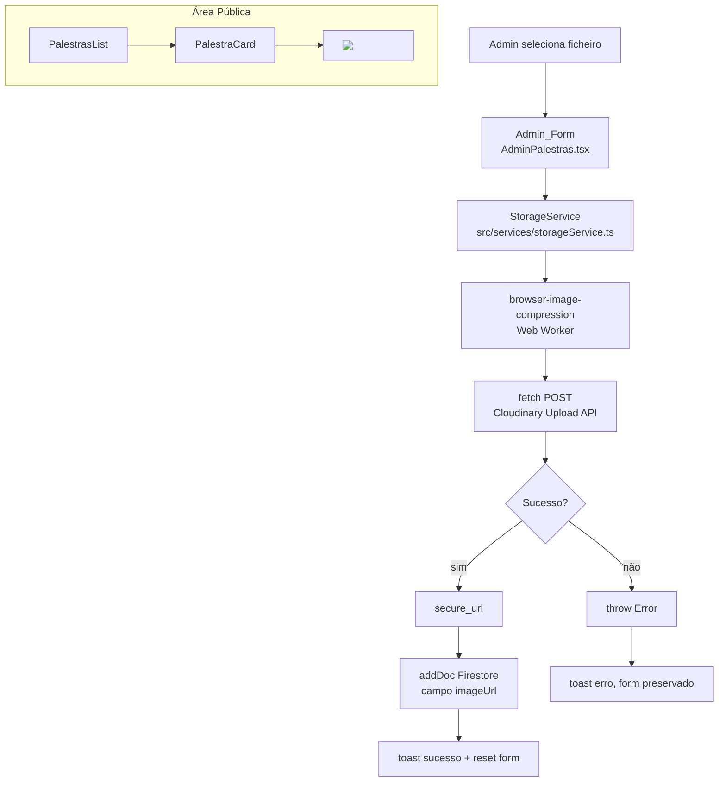

# Design Document — image-upload-palestras

## Overview

Esta feature substitui o fluxo de imagem baseado em Google Drive por um pipeline de upload direto para o **Cloudinary**, executado inteiramente no browser. O administrador seleciona um ficheiro de imagem no formulário `AdminPalestras`, o browser comprime a imagem com `browser-image-compression`, faz upload para o Cloudinary via `fetch` + `FormData`, e persiste a `secure_url` retornada no campo `imageUrl` do documento Firestore. A área pública (`PalestraCard`) passa a consumir `imageUrl` diretamente, eliminando `driveImage.ts` e `driveImageId`.

Não é introduzido nenhum backend intermediário. Firebase Auth e Firestore continuam inalterados. A única nova dependência de runtime é `browser-image-compression`.

---

## Architecture



### Decisões de design

- **Unsigned upload preset**: elimina a necessidade de um servidor de assinatura. O preset é configurado no painel Cloudinary com a pasta `palestras` como destino.
- **Sem SDK Cloudinary**: o upload é um simples `fetch` multipart — zero dependências adicionais além de `browser-image-compression`.
- **Compressão em Web Worker**: `browser-image-compression` usa um worker interno, mantendo a UI responsiva durante a compressão.
- **`imageUrl` como campo canónico**: o campo `driveImageId` é removido do schema Zod, da interface `Palestra` e do Firestore. Documentos legados com `driveImageId` ficam inalterados na base de dados mas deixam de ser lidos.

---

## Components and Interfaces

### `StorageService` — `src/services/storageService.ts`

```typescript
/**
 * Comprime e faz upload de um ficheiro de imagem para o Cloudinary.
 *
 * Pré-condições:
 *   - file.type ∈ { "image/jpeg", "image/png", "image/webp" }
 *   - VITE_CLOUDINARY_CLOUD_NAME e VITE_CLOUDINARY_UPLOAD_PRESET definidos
 *
 * Pós-condições:
 *   - Retorna uma string HTTPS não-vazia (secure_url do Cloudinary)
 *   - O ficheiro enviado tem tamanho ≤ 0.5 MB e dimensão máxima ≤ 1200 px
 *
 * @throws Error se as env vars estiverem ausentes, o tipo de ficheiro for inválido,
 *               a compressão falhar, ou o upload retornar status não-2xx.
 */
export async function uploadPalestraImage(file: File): Promise<string>
```

Internamente:
1. Valida `VITE_CLOUDINARY_CLOUD_NAME` e `VITE_CLOUDINARY_UPLOAD_PRESET` — lança erro descritivo se ausentes.
2. Valida `file.type` contra a lista de tipos permitidos — lança erro se inválido.
3. Chama `imageCompression(file, { maxSizeMB: 0.5, maxWidthOrHeight: 1200, useWebWorker: true })`.
4. Constrói `FormData` com `file`, `upload_preset` e `folder: "palestras"`.
5. `fetch("https://api.cloudinary.com/v1_1/{cloudName}/image/upload", { method: "POST", body: formData })`.
6. Se `!response.ok`, lança `Error` com o status HTTP.
7. Retorna `data.secure_url`.

---

### Interface `Palestra` (atualizada)

```typescript
// src/components/PalestraCard.tsx  (e espelhada em AdminPalestras.tsx)
export interface Palestra {
  id: string
  titulo: string
  palestrante: string
  data: string
  resumo: string
  imageUrl: string        // ← novo campo (Cloudinary secure_url)
  // driveImageId removido
  createdAt?: Timestamp
}
```

---

### `AdminPalestras.tsx` — alterações

| Antes | Depois |
|---|---|
| `<Input id="driveImageId" ...>` | `<input type="file" accept="image/jpeg,image/png,image/webp">` + preview `` |
| `driveImageId: z.string().trim().min(1)` | `imageFile: z.instanceof(File, { message: "Imagem é obrigatória" })` |
| `addDoc({ ...formData, createdAt })` | `addDoc({ ...formData, imageUrl, createdAt })` sem `driveImageId` |
| Botão "Adicionar" sempre activo | Desativado + spinner "A otimizar e enviar imagem..." durante upload |

O campo de ficheiro é gerido com `useRef<HTMLInputElement>` e `useState<string>` para a URL de preview (`URL.createObjectURL`). O `handleSubmit` chama `uploadPalestraImage` antes de `addDoc`.

---

### `PalestraCard.tsx` — alterações

- Remove `import { getDriveImageUrl } from "@/lib/driveImage"`.
- ``.

---

### Ficheiros a remover

- `src/lib/driveImage.ts`
- `src/lib/driveImage.test.ts`

---

## Data Models

### Documento Firestore — colecção `palestras`

```typescript
// Schema novo (sem driveImageId)
interface PalestraDoc {
  titulo: string        // string não-vazia
  palestrante: string   // string não-vazia
  data: string          // formato "YYYY-MM-DD"
  resumo: string        // string não-vazia
  imageUrl: string      // HTTPS URL do Cloudinary, não-vazia
  createdAt: Timestamp  // serverTimestamp()
}
```

Documentos legados com `driveImageId` permanecem na base de dados sem alteração; a aplicação simplesmente deixa de ler esse campo.

### Variáveis de ambiente

```
VITE_CLOUDINARY_CLOUD_NAME=<cloud_name>
VITE_CLOUDINARY_UPLOAD_PRESET=<unsigned_preset_name>
```

### Schema Zod (AdminPalestras)

```typescript
const palestraSchema = z.object({
  titulo:      z.string().trim().min(1, 'Título é obrigatório'),
  palestrante: z.string().trim().min(1, 'Palestrante é obrigatório'),
  data:        z.string().trim().min(1, 'Data é obrigatória'),
  resumo:      z.string().trim().min(1, 'Resumo é obrigatório'),
  // imageFile validado fora do schema Zod via useRef + validação manual
})
```

A validação do ficheiro de imagem é feita manualmente antes de chamar `handleSubmit` porque `react-hook-form` com `z.instanceof(File)` requer configuração extra de `FileList`; a abordagem mais simples é verificar `fileRef.current?.files?.[0]` no handler.

---


## Correctness Properties

*A property is a characteristic or behavior that should hold true across all valid executions of a system — essentially, a formal statement about what the system should do. Properties serve as the bridge between human-readable specifications and machine-verifiable correctness guarantees.*

### Property 1: Upload request body invariant

*For any* valid image file (JPEG, PNG ou WebP), quando `uploadPalestraImage` é chamado, o `FormData` enviado ao Cloudinary deve conter `upload_preset` igual ao valor de `VITE_CLOUDINARY_UPLOAD_PRESET` e `folder` igual a `"palestras"`.

**Validates: Requirements 1.3, 3.2**

---

### Property 2: Compression output constraints

*For any* image file, após a compressão pelo `browser-image-compression`, o ficheiro resultante deve ter tamanho ≤ 0.5 MB e a dimensão maior (largura ou altura) ≤ 1200 px.

**Validates: Requirements 2.1, 2.2**

---

### Property 3: Upload returns secure_url

*For any* valid image file e uma resposta HTTP 200 simulada do Cloudinary contendo um campo `secure_url`, `uploadPalestraImage` deve retornar exatamente esse valor de `secure_url` como string não-vazia.

**Validates: Requirements 3.1, 3.3**

---

### Property 4: Invalid file type rejection

*For any* ficheiro cujo `file.type` não pertença ao conjunto `{ "image/jpeg", "image/png", "image/webp" }`, `uploadPalestraImage` deve lançar um erro antes de efetuar qualquer chamada de rede.

**Validates: Requirements 3.5**

---

### Property 5: File selection generates preview URL

*For any* ficheiro de imagem selecionado no campo de upload, o componente `AdminPalestras` deve produzir uma URL de preview não-vazia (via `URL.createObjectURL`) e exibi-la no elemento `` de preview.

**Validates: Requirements 4.2**

---

### Property 6: Form rejects submission without file

*For any* tentativa de submissão do formulário sem um ficheiro de imagem selecionado, a validação deve falhar e o documento não deve ser escrito no Firestore.

**Validates: Requirements 4.3, 4.4**

---

### Property 7: Firestore document invariant

*For any* submissão bem-sucedida do formulário, o documento escrito no Firestore deve conter o campo `imageUrl` com a `secure_url` retornada pelo `StorageService` e não deve conter o campo `driveImageId`.

**Validates: Requirements 6.1, 6.2**

---

### Property 8: PalestraCard render invariant

*For any* objeto `Palestra` com um `imageUrl` válido, o componente `PalestraCard` deve renderizar um elemento `` com `src` igual a `palestra.imageUrl` e atributo `loading="lazy"`.

**Validates: Requirements 7.1, 7.2**

---

## Error Handling

| Cenário | Origem | Comportamento |
|---|---|---|
| `VITE_CLOUDINARY_*` ausentes | `storageService.ts` | Lança `Error` com mensagem descritiva; a app não arranca em produção |
| Tipo de ficheiro inválido | `storageService.ts` | Lança `Error("Tipo de ficheiro não suportado: ...")` antes de qualquer chamada de rede |
| Compressão falha | `storageService.ts` (propagado de `browser-image-compression`) | Lança erro; `AdminPalestras` captura e exibe `toast` de erro, formulário preservado |
| Upload Cloudinary não-2xx | `storageService.ts` | Lança `Error("Upload falhou: HTTP {status}")` |
| Escrita Firestore falha | `AdminPalestras.tsx` | `catch` no `handleSubmit` exibe `toast` de erro, formulário preservado |
| Nenhum ficheiro selecionado | `AdminPalestras.tsx` | Validação manual antes de `handleSubmit`; exibe mensagem de erro no campo |

Todos os erros do `StorageService` são propagados como `Error` nativo — sem tipos de erro customizados — para manter a superfície da API simples.

---

## Testing Strategy

### Abordagem dual

- **Testes unitários**: exemplos concretos, casos de erro, integrações entre componentes.
- **Testes de propriedade**: validação universal com inputs gerados aleatoriamente.

### Biblioteca de property-based testing

Usar **[fast-check](https://github.com/dubzzz/fast-check)** (TypeScript nativo, sem dependências pesadas).

```
npm install --save-dev fast-check
```

### Configuração dos testes de propriedade

- Mínimo de **100 iterações** por propriedade (`numRuns: 100`).
- Cada teste deve referenciar a propriedade do design com o tag:
  `// Feature: image-upload-palestras, Property {N}: {título}`
- Cada propriedade de correctness deve ser coberta por **um único** teste de propriedade.

### Testes de propriedade (mapeamento)

| Propriedade | Ficheiro de teste | Geradores fast-check |
|---|---|---|
| P1 — Upload request body invariant | `storageService.test.ts` | `fc.record({ name: fc.string(), type: fc.constantFrom("image/jpeg","image/png","image/webp") })` |
| P2 — Compression output constraints | `storageService.test.ts` | Ficheiros de imagem sintéticos com dimensões e tamanhos variados |
| P3 — Upload returns secure_url | `storageService.test.ts` | `fc.webUrl()` para `secure_url` simulada |
| P4 — Invalid file type rejection | `storageService.test.ts` | `fc.string()` filtrado para excluir tipos válidos |
| P5 — File selection generates preview | `AdminPalestras.test.tsx` | `fc.record(...)` com File simulado |
| P6 — Form rejects without file | `AdminPalestras.test.tsx` | Submissões com campo de ficheiro vazio |
| P7 — Firestore document invariant | `AdminPalestras.test.tsx` | `fc.record(...)` com dados de palestra válidos |
| P8 — PalestraCard render invariant | `PalestraCard.test.tsx` | `fc.record({ imageUrl: fc.webUrl(), titulo: fc.string(), ... })` |

### Testes unitários (exemplos e edge cases)

- `storageService.test.ts`: lança erro quando env vars ausentes; lança erro para resposta HTTP 500.
- `AdminPalestras.test.tsx`: exibe toast de sucesso após submissão válida; exibe toast de erro quando Firestore falha; botão desativado durante upload; botão reativado após conclusão.
- `PalestraCard.test.tsx`: renderiza sem `getDriveImageUrl`; não contém referência a `driveImageId`.

### Dependências a instalar

```bash
npm install browser-image-compression
npm install --save-dev fast-check @testing-library/react @testing-library/jest-dom vitest jsdom
```
